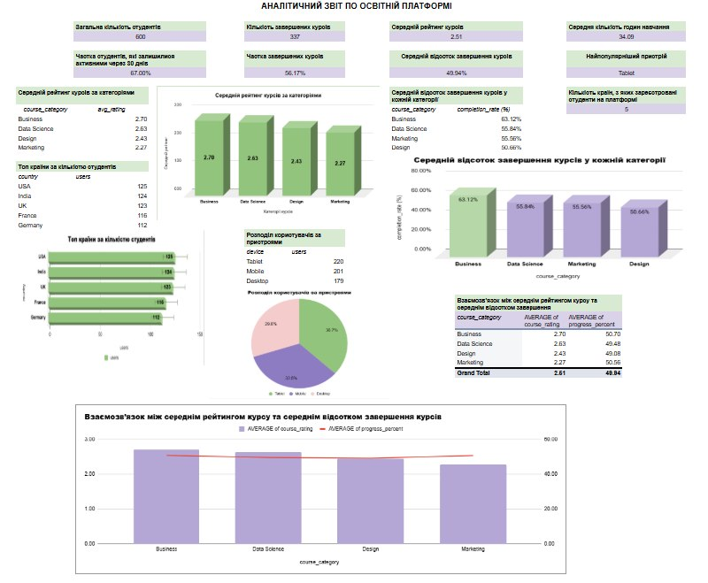

# 📊 EdTech Business Metrics Analysis

This project presents a business and learning analytics dashboard for an EdTech platform using real-world user data.
## 📸 Dashboard Preview

  

## 📌 Project Overview

The goal of this analysis is to evaluate student engagement, course performance, and retention metrics to support data-driven decision-making.

## 📊 Key Metrics

* Total users: 600
* 30-day retention rate: 67%
* Course completion rate: 56.17%
* Average course rating: 2.51
* Average learning time: 34 hours

## 🔍 Analysis Includes

* User retention analysis
* Course completion analysis
* Average rating by category
* User distribution by device
* Geographic analysis (top countries)
* Relationship between rating and completion rate

## 🛠 Tools Used

* Google Sheets
* Excel
* Basic SQL logic
* Data visualization

## 📈 Key Insights

* Business courses show the highest completion rate
* Tablet users dominate the platform
* Significant differences in engagement across countries
* Positive relationship between course rating and completion rate

## 📸 Dashboard Preview

(see images below)
